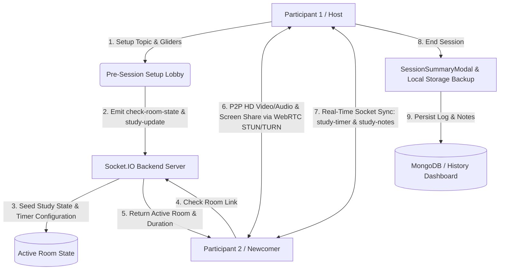

<div align="center">

# PeerSpace
### Real-Time P2P WebRTC Video Study Rooms & Synchronized Pomodoro Collaboration Platform

[](https://reactjs.org/)
[](https://nodejs.org/)
[](https://expressjs.com/)
[](https://www.mongodb.com/)
[](https://webrtc.org/)
[](https://socket.io/)

<br />

> **Launch instant peer-to-peer WebRTC video study rooms with synchronized Pomodoro timers, real-time shared markdown notes and auto-saved session logs.**

</div>

---

## What is PeerSpace?

**PeerSpace** is an advanced, state-of-the-art virtual study and collaboration workspace built for students, developers, and distributed teams. Unlike traditional video calling applications where you sit passively on camera, PeerSpace transforms every meeting into a highly structured **Productivity Session**.

Whether you are preparing for technical placement interviews, grinding DSA graphs with a study partner, or hosting a remote standup, PeerSpace synchronizes your **shared study goals**, **Pomodoro focus/break countdowns**, and **live collaborative notes** with sub-millisecond precision across both participants via **Socket.IO** and **WebRTC**.

---

## Key Features

### 1. Synchronized Pomodoro Study Rooms (`StudyPanel.jsx`)
* **Interactive Focus Gliders:** Dial in your exact study workflow before entering the call using our smooth **0–90m Focus Duration Glider** and **1–10 Pomodoro Sessions Glider**.
* **Phase-Driven Pomodoro Engine:** Real-time runtime synchronization (`Focus Mode`, `Break Mode`, `Idle`, and `Session Complete`) powered by Socket.IO (`study-timer`). When one peer clicks **Start Focus**, **Pause**, or **End**, both screens transition simultaneously.
* **Dual-Clock Display:** Interactive circular progress ring coupled with dedicated tabs (`Focus Time` vs `Break Time`) tracking completed rounds (`e.g., Session 1 of 4`).

### 2. Smart Active Room Detection & Auto-Sync (`check-room-state`)
* **Zero-Overwriting Lobby:** When a host initializes a study room (`e.g., /study-hall`), late joiners automatically detect the active room right from the lobby (`ACTIVE STUDY ROOM DETECTED`).
* **Instant Adoption:** Newcomers skip redundant setup questions and automatically adopt the host's exact **Shared Topic**, **Goal**, **Pomodoro countdown duration**, and **Session numbers** (`study-update` & `study-sync`).

### 3. Real-Time Collaborative Notes & Local Storage Backup
* **Live Shared Scratchpad:** Take structured notes collaboratively during your call. Every keystroke is synced instantly with your peer via low-latency Socket.IO events (`study-notes`).
* **Auto-Saved Session Logs:** Upon ending a call, the `SessionSummaryModal` automatically backs up your notes to your local browser storage and offers instant `.txt` / markdown export so no study session is ever lost.

### 4. Call History & Auto-Saved Dashboard (`/history`)
* **Personalized Call Logs:** Authenticated users (via JWT) can track all previous video meetings and duration logs directly from MongoDB.
* **Dedicated Notes Archive:** A dedicated **Auto-Saved Session Notes** grid displays all completed Pomodoro study sessions, study topics, goals, and formatted notes right inside your user dashboard.

### 5. Global P2P WebRTC Video, Audio & Screen Sharing
* **HD Low-Latency P2P Video:** Powered by direct peer-to-peer WebRTC connections with dynamic camera and microphone toggling (`getUserMedia`).
* **Instant Screen Sharing:** Share slides, code editors, or diagrams effortlessly with one-click screen sharing (`getDisplayMedia`).
* **Global NAT Traversal:** Pre-configured with **Google STUN (`stun.l.google.com:19302`)** and **OpenRelay TURN (`turn:openrelay.metered.ca:80`)** servers for 100% reliable connection across different Wi-Fi routers, university firewalls, and countries (`environment.js`).

---

## System Architecture & Data Flow


## Technology Stack

| Component | Technology | Description |
| :--- | :--- | :--- |
| **Frontend** | React 18, React Router, CSS Modules | High-performance reactive UI with custom hooks and CSS design systems |
| **Backend** | Node.js, Express.js | RESTful API server handling authentication and room signaling |
| **Database** | MongoDB, Mongoose ORM | Persistent storage for user accounts, JWT credentials, and call histories |
| **Realtime Signaling** | Socket.IO | Sub-millisecond bi-directional synchronization for timers, room state, and chat |
| **Video & Audio** | WebRTC (RTCPeerConnection) | Direct peer-to-peer media streams with fallback TURN relay servers |

---

## Getting Started Locally

Follow these quick steps to spin up PeerSpace on your local machine:

### 1. Clone the Repository
```bash
git clone https://github.com/Sahilshrma31/PeerSpace.git
cd PeerSpace
```

### 2. Configure & Start Backend Server
```bash
cd backend
npm install
```
Create a `.env` file inside the `/backend` directory:
```env
MONGO_URI=mongodb://127.0.0.1:27017/peerspace
PORT=8000
```
Start the backend development server:
```bash
npm run dev
```

### 3. Configure & Start Frontend App
Open a new terminal window:
```bash
cd frontend
npm install
npm start
```
Visit `http://localhost:3000` in your browser to launch your first instant study room!

---


## Author & Connect

Developed by **[Sahil Sharma](https://github.com/Sahilshrma31)**  

* **GitHub:** [https://github.com/Sahilshrma31](https://github.com/Sahilshrma31)
* **LinkedIn:** [https://linkedin.com/in/sahilshrma31](https://linkedin.com/in/sahilshrma31)
